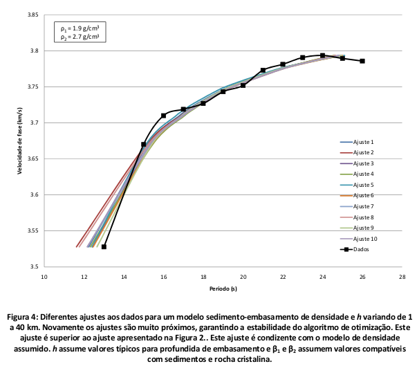

# 3-parameter Love wave group velocity inversion with Ant Colony Optimization

Developed and used for a seismic waves class in 2008.

The Ant Colony Optimization implemented in `acor.h` is that of Socha & Dorigo
(2008).

Program `evoL.c` runs the inversion on a given data set (see
`sao-vicente-2008-group-velocity.txt`) using a layer-over-halfspace model.
Outputs are the best layer thickness and shear velocities.

Included the report used for the class assignment.

## License

gmt-python is free software: you can redistribute it and/or modify it under the
terms of the **BSD 3-clause License**. A copy of this license is provided in
`LICENSE.txt`.

## References

Socha, K. & Dorigo, M., 2008. Ant colony optimization for continuous domains,
European Journal of Operational Research, 185(3), 1155-1173.
